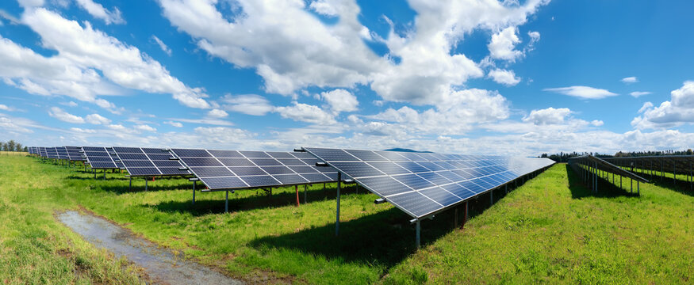
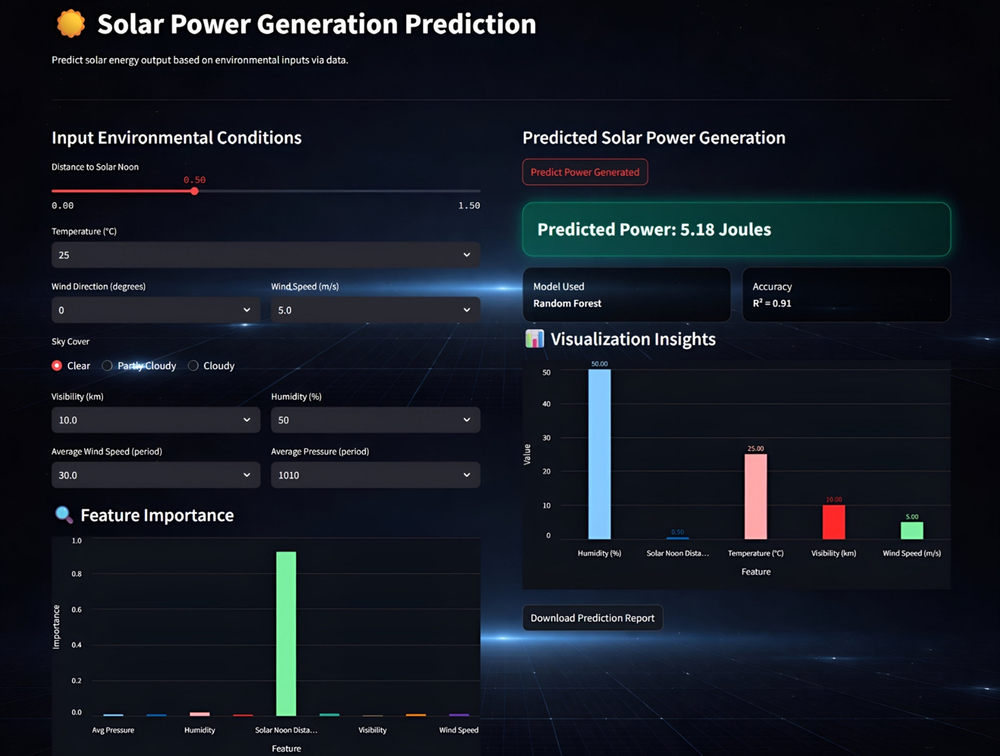

<!-- 🌟 BANNER -->
<p align="center">
  
</p>

<h1 align="center">🌞 Solar Power Generation Prediction</h1>
<h3 align="center">⚡ Machine Learning | Renewable Energy | Data Science Project</h3>

<p align="center">
  
</p>

---

## 📌 Overview

🚀 This project predicts **solar power generation** using Machine Learning techniques.  
It helps in optimizing energy usage and supports the transition toward **renewable energy systems**.

🔍 The model is trained using environmental parameters like:
- 🌡️ Temperature  
- ☀️ Irradiance  
- 💧 Humidity  
- ⏳ Time-based features  

---

## 🎯 Problem Statement

Traditional energy systems lack accurate forecasting methods.  
This project aims to solve this by building a **predictive ML model** that estimates solar power output efficiently.

---
## 📌 Project Overview

This project presents a **robust Machine Learning pipeline** that predicts solar power generation based on environmental and temporal data.

💡 Designed to simulate real-world renewable energy systems, this project demonstrates:

- End-to-end ML pipeline  
- Data preprocessing & feature engineering  
- Regression-based model training  
- Model evaluation & optimization  
- Deployment-ready structure  

---

## ✨ Features

⚡ Solar Power Prediction  
🌡️ Environmental Data Processing  
📊 Feature Engineering & Scaling  
🤖 Machine Learning Model for Prediction  
⚡ High Accuracy & Fast Inference  
🧩 Clean & Modular Pipeline Design  

---

## 🛠️ Tech Stack

<p>
  
  
  
  
  
  
</p>

---
Raw Solar Data → Data Preprocessing → Feature Engineering → Scaling → Model Training → Evaluation → Prediction System


---

## 📸 Screenshots of Deployment

<p align="center">
  
</p>

---

## ⚙️ Installation Guide

```bash
# Clone the repository
git clone https://github.com/yashsonone99/Solar-Power-Generation-Prediction.git

# Navigate to project
cd Solar-Power-Generation-Prediction

# Install dependencies
pip install -r requirement.txt

# Run application
python app.py
